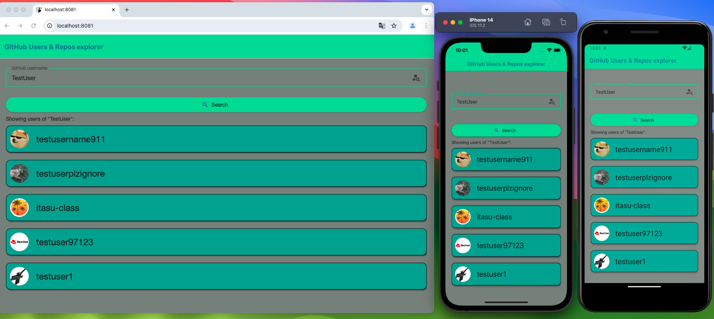
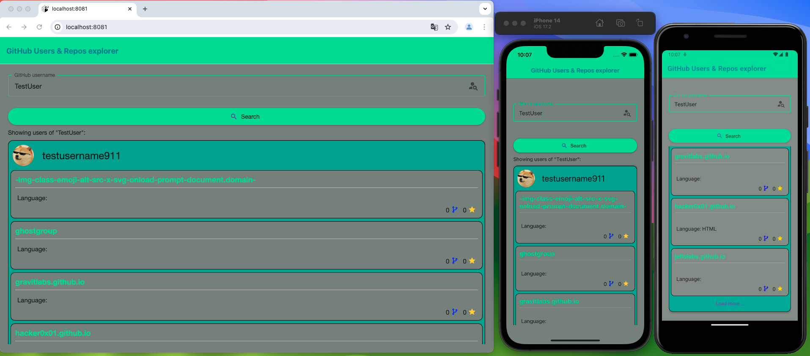
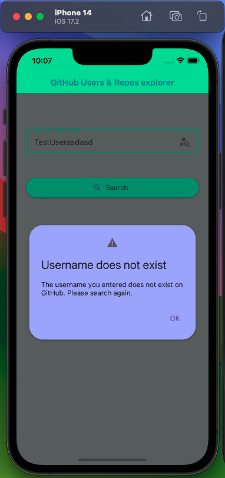

# Welcome to my Github Users & Repos Explorer app 👋





## 📝 My comments:

📌 Supported platforms: 🍏 iOS, 🤖 Android, 💻 Web

📌 The "GitHub Users & Repos explorer" app is supposed to connect to GitHub API, search for five users according to the username entered in TextInput, then render a FlatList with search results, and after clicking on one of the users download the public repositories of the selected user from GitHub

📌 The app consists of one screen, which contains TextInput and Search Button and below it a place for FlatList.

📌 The app was styled using 'react-native-paper' (https://reactnativepaper.com/), which contains a collection of customizable and production-ready components for React Native, following Google’s Material Design guidelines.

## 📝 App description:

📌 TextInput only allows you to enter characters allowed for the account name by GitHub. Entering an invalid character displays a message below the input.

📌 SearchButton is disabled for an empty input, and also disables when entering an invalid character. Only when the correct characters are entered will the button be activated.

📌 Entering a non-existent account name in GitHub and attempting to search after receiving the appropriate information from the API results in displaying the <Dialog> element (it is similar to Modal)

📌 The application searches for five users according to the entered input. Then it renders a FlatList consisting of <Card> components for each user. The <Card> component contains a button that expands the component, downloads the user's repositories in it and displays the next FlatList (with repos) nested in the <Card> element. In this case, I decided to add the per_page: 5 and page parameters in the API query. This is to improve the application's performance and prevent loading a very large number of repositories for some users. Therefore, after the first five repositories have loaded, the Load More button appears below to load the next five repositories. After loading all the repositories for a given user, the button disappears.

📌 For each repository its name, description, programming language and number of forks and stars are displayed

📌 Redux is implemented to manage the state in the application, which, for example, saves the searched users, repositories in the state, or clears the state of users or repositories during the next search

## UPDATE 1:

🎯 ~~CODE CLEANING! e.g. Separate some components from the index file to other files etc.~~ 
✅ Done. Project structure changed, separated components to different files

🎯 ~~ADD UNIT TESTS!~~ 
✅ Done: 
🪧 Added necessary dependencies for testing (@testing-library/react-native)
🪧 Added 'testID' props to test elements
🪧 Added tests to validate rendering, input handling, and function calls for SearchBar component.  
🪧 Implemented tests for DialogComponent to ensure proper visibility toggling.
🪧 Implemented tests for UserCard to check for correct rendering and user interactions.
💡 You can run the tests using `npm run test` in your project directory

🎯 ~~Implement @shopify/flash-list instead of using FlatList~~ 
✅ Done (RepoFlashList file)

🎯 ~~Add accessibility labels, hints etc~~ 
✅ Done & tested with Android TalkBack

🎯 ~~Fix flashlistHeaderComponent to do not display when changing TextInput values~~ 
✅ Done

🎯 ~~Check for errors & bugs on more devices~~
✅ Tested

## WHAT TO DO NEXT:
🎯 Add theme

# Contact:

📬 matraszek.maciek@gmail.com


## Get started

This is an [Expo](https://expo.dev) project created with [`create-expo-app`](https://www.npmjs.com/package/create-expo-app).

1. Install dependencies

   ```bash
   npm install
   ```

2. Start the app

   ```bash
    npx expo start --go
   ```

In the output, you'll find options to open the app in a

- [development build](https://docs.expo.dev/develop/development-builds/introduction/)
- [Android emulator](https://docs.expo.dev/workflow/android-studio-emulator/)
- [iOS simulator](https://docs.expo.dev/workflow/ios-simulator/)
- [Expo Go](https://expo.dev/go), a limited sandbox for trying out app development with Expo

## Learn more

To learn more about developing your project with Expo, look at the following resources:

- [Expo documentation](https://docs.expo.dev/): Learn fundamentals, or go into advanced topics with our [guides](https://docs.expo.dev/guides).
- [Learn Expo tutorial](https://docs.expo.dev/tutorial/introduction/): Follow a step-by-step tutorial where you'll create a project that runs on Android, iOS, and the web.